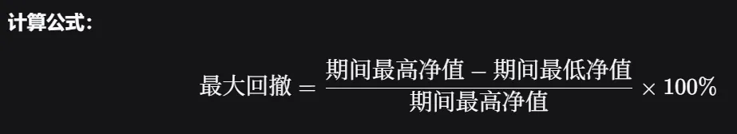

# Fund Financial

# **2026.6.4**

**基金的回撤**，简单来说，就是指在一段特定时间内，基金净值从**高点下跌到低点的最大幅度**，通常用百分比表示。它是衡量基金**风险控制能力**和投资者**可能承受的最大亏损**的重要指标。

***

上证指数---全称"上证综合指数"，覆盖上海证券交易所所有上市股票，按总市值加权。

沪深300---从沪深两市中选出**市值最大、流动性最好的300只股票**，是最主流的"宽基指数"。

中证500 / 中证1000

* **中证500**：剔除沪深300后，选排名 301-800 的股票 → **中盘股**
* **中证1000**：排名 801-1800 → **小盘股**

***

**基金的回撤**，简单来说，就是指在一段特定时间内，基金净值从**高点下跌到低点的最大幅度**，通常用百分比表示。它是衡量基金**风险控制能力**和投资者**可能承受的最大亏损**的重要指标。



***

**宽基 = 覆盖面广、不限定行业的基础指数基金。**  

窄基像**专用频段**（如5G的n78频段），宽基像**全频段扫描**——专用频段性能强但覆盖窄，全频段覆盖广但单点不强。

***

| **​**    | **ETF（场内）**      | **场外基金**     |
| -------- | ---------------- | ------------ |
| **买卖方式** | 像股票一样，在交易软件上实时买卖 | 在基金APP上申购/赎回 |
| **价格**   | 实时变动，一天无数个价      | 每天一个价（收盘净值）  |
| **门槛**   | 需要证券账户           | 支付宝/天天基金就能买  |
| **费用**   | 一般更低             | 稍高           |

***

**QDII = Qualified Domestic Institutional Investor（合格境内机构投资者）**

简单说：**用人民币在国内买基金，基金拿你的钱去投资海外市场。**

***

基金的总收益，可以用这个简单公式拆解：

> **基金收益 = 无风险收益 + Beta × (市场收益 – 无风险收益) + Alpha**

其中：

* **无风险收益**：比如国债利息，相当于“什么都不做白拿的钱”。
* **市场收益**：比如沪深300指数涨了10%。

具体看 Beta 的几种情况：

| **Beta 值** | **含义**         | **通俗解释**                                       |
| ------------------------------------------------------------- | ----------------------------------------------------------------- | ------------------------------------------------------------------------------------------------- |
| Beta = 1   | 基金和市场**同步波动**  | 大盘涨10%，基金大概也涨10%（不算Alpha的话）                    |
| Beta = 1.5 | 基金比市场**波动更大**  | 大盘涨10%，基金涨15%；大盘跌10%，基金跌15% —— **进攻性强，但跌起来也狠** |
| Beta = 0.5 | 基金比市场**波动更小**  | 大盘涨10%，基金只涨5%；大盘跌10%，基金只跌5% —— **比较稳健**        |
| Beta = 0   | 基金**几乎不受市场影响** | 比如货币基金，大盘涨跌跟它没关系                               |
| Beta ＜ 0   | 资产与市场的走势呈负相关。                                                     | 这意味着当市场上涨时，该资产的价格往往下跌，反之亦然。负贝塔的资产通常被称为**避险资产**，因为它们可能在市场下跌时表现得更好。                                 |

再看 Alpha：

* **Alpha > 0**：基金经理创造了**正超额收益**。例如大盘涨10%，按Beta算应该涨12%，结果基金涨了15%，那么Alpha = +3%。**这是优秀主动型基金的标志**。
* **Alpha = 0**：收益完全来自市场和承担的风险，没有额外本事。**指数基金通常接近0**（因为只是复制指数）。
* **Alpha \< 0**：基金经理**跑输了**市场。扣除费用后，还不如买指数基金。

阿尔法α从更细致的角度来说更应该代表着不跟随指数投入资金外的额外资金，该部分资金在基金经理和市场涨跌共同作用下带来的额外收益。（例如80%为指数被动资金，20%为主动型资金，该部分资金可以在经理与市场二者共同的作用下取得那80%完全被动跟随资金外的额外收益）

***

* **ETF**：可以在股票账户里像买卖股票一样交易的指数基金。**“可以场内交易的指数基金”**。
* **ETF联接基金**：专门用来买ETF的基金，方便没有股票账户的人通过基金平台间接投ETF。
* **FOF（基金中的基金）**：不直接买股票或债券，而是买一篮子其他基金。**“买基金的基金”**——帮你做资产配置，分散再分散。
* **QDII基金**：可以投资海外市场（美股、港股、德国股市等）的基金。**“帮你换外汇去买外国资产”**

***

基金单位净值（NAV）怎么算

核心公式

​$\boldsymbol{基金单位净值 = \frac{基金总资产 - 基金总负债}{基金总份额}}$​

* **总资产**：持仓股票、债券、现金、存款、应收利息等全部市值（按当日收盘市场价计价）
* **总负债**：管理费、托管费、应付赎回款、借款等
* **总份额**：在外发行的基金份数（每天申赎会变动）

***

​

# **2026.6.5**

IPO 是 **Initial Public Offering**（首次公开募股）的缩写，指一家公司**第一次**把它的一部分股份向公众公开出售。简单说，就是一家原本“私有的”公司，通过这个流程变成“上市的”公司。

***

**追涨杀跌**是投资中一种常见的交易行为，指：

* **追涨**：看到某个资产（如股票、基金）价格不断上涨，因担心错过继续上涨的收益，冲动地买入。
* **杀跌**：看到持有的资产价格持续下跌，因恐慌害怕亏损扩大，不计成本地卖出。

简单概括就是：**涨了才买，跌了才卖**。

**背后的心理**

它主要受两种情绪驱动：

* **贪婪（怕踏空）**：看到别人赚钱，生怕自己错过“上车”机会，在价格高位冲进去。
* **恐惧（怕亏损）**：价格一跌就心慌，想赶紧“止损”逃命，往往卖在阶段性的低点。

***

> 基金申购赎回费用较高，频繁交易会显著侵蚀收益。根据测算，如果按1.5%的申赎费率计算，年度换仓的投资者每年损失可能高达16.59%

这个数字背后的数学关系，简单说就&#x662F;**“复利效应下的损耗累积”**。你感觉1.5%的费率不高，但乘以交易频率后，损耗会像滚雪球一样吃掉你的本金。

具体公式是：**最终资产 = 初始本金 × (1 - 单次总费率)^(年交易次数)**

假设单次“申购+赎回”的总费率为**1.5%**（申购1.5% + 赎回0%，但很多基金短期赎回费很高，这里按综合1.5%算），如果**每月换仓一次**，一年交易12次，那么：

* 每次交易后，你的资金只剩下原来的 **98.5%**（即100 - 1.5）。
* 12次交易后，资金剩余比例 = 0.985^12 ≈ **0.834**。
* 损失比例 = 1 - 0.834 = **0.166**，也就是**16.6%**。

你看，每次只少一点，但重复12次后，总计就少了16.6%。这还没算上其他可能的赎回费（比如持有少于7天收1.5%）。

***

> 定投如何影响投资中的均摊成本

**核心逻辑**：

固定金额买入，价格低时自动多买份额，价格高时少买份额。最终你的**平均买入成本**会低于这期间所有价格的平均值。

**数字例子（假设每月定投1000元）**

| **月份** | **基金净值（元）** | **买入份额（份）**         |
| --------------------------------------------------------- | -------------------------------------------------------------- | ---------------------------------------------------------------------- |
| 1月     | 1.5         | 1000 ÷ 1.5 ≈ 666.67 |
| 2月     | 1.0         | 1000 ÷ 1.0 = 1000   |
| 3月     | 0.5         | 1000 ÷ 0.5 = 2000   |
| 4月     | 1.0         | 1000 ÷ 1.0 = 1000   |
| 5月     | 1.5         | 1000 ÷ 1.5 ≈ 666.67 |

**统计一下**：

* 总投入 = 1000 × 5 = **5000 元**
* 总份额 = 666.67 + 1000 + 2000 + 1000 + 666.67 = **5333.34 份**
* 平均买入成本 = 总投入 ÷ 总份额 = 5000 ÷ 5333.34 ≈ **0.9375 元**

而期间五个价格的平均值是 (1.5 + 1.0 + 0.5 + 1.0 + 1.5) ÷ 5 = **1.0 元**。

**你的实际成本 0.9375 元 \< 价格平均值 1.0 元**。这就是均摊成本的魔力——你在低价（0.5元）时买了大量份额（2000份），拉低了整体成本。

而你的**平均成本线**（0.9375元）低于起始点，也低于终点。只要净值反弹超过你的平均成本，就开始盈利——甚至不需要涨回最初的高点。

基金净值先跌后涨，画在图上就像一个“U”形（😊 嘴角向上）。这就是定投中的微笑曲线〰️。

**意义**：在市场下跌途中坚持定投，不断用低成本积累份额；等市场回升，即使净值还没回到最初的高点，你已经可以盈利了。

***

> ### 误区澄清：偏爱低净值的基金

有些投资者觉得净值低的基金“更便宜”“上涨空间更大”。

**关键认知**：基金净值高低和股票价格高低的含义完全不同。股票价格高说明估值变贵了，而基金累计净值高恰恰说明这只基金过往业绩优秀。投资1万元，买1元的基金和买3元的基金，涨1%都是赚100元，和买入净值无关。

但是两者的持有份数不一样，在后续的分红过程中，因为分红按照持有股份数量进行分红，持有多的基金后续分红金额也会变多。但是总资产依然是不影响的。

​

# **2026.6.6**

> **卡玛比率，夏普比率和信息比率**

* **夏普比率** = 超额收益(投资组合收益率 - 无风险利率) / **整体波动**（看重日常体验的平稳度）

看的更多是基金的整体波动率，数值越大可以说明该基金的波动越小，更稳定；也是说明该基金能够以更小的波动取得不错的收益

* **卡玛比率** = 超额收益（年化收益率）/ **最大回撤**（看重底线防守，防止心态崩溃）

更加注重基金的最大亏损，数值越大说明基金的抗压能力越好，也说明基金能够以一个更加适应市场亏损的能力去取得对应的收益

* **信息比率** = 超额收益 (投资组合收益率 - 基准指数收益率)/ **跟踪误差**（看重基金经理超越同行的真实水平）

衡量基金经理的个人能力，相比业内基准，经理能够在偏离整体大盘多少的情况下去获得相应收益。基金经理为了跑赢大盘，主动偏离基准所承担的额外风险（跟踪误差），是否换来了相应的超额回报。数值越大说明基金经理能够在不过多偏离大盘的情况下取得相应收益。

跟踪误差衡量的是一种不确定性，其数值越小说明在投资中不确定性带来的相关风险也会变小

个人思考：投资在做不同方向上的信息差缩减，信息熵优化，降低风险。信息论

***

**指数基金/基金跟踪指数**

指数是用于描述统计整个行业的数值，例如沪深300指数，中证500指数。指数代表着整个行业的市场航向

指数基金是一种**被动管理**的基金，其核心目标不是战胜市场，而是**贴近市场**，获取市场的平均回报。该类基金会跟踪瞄准的行业指数，按照指数内的股票权重以及交易量去进行基金的配仓。

***
  
* **宽基指数基金**
  就像买了一篮涵盖各行各业的综合性“水果大礼包”，覆盖面广，代表整个市场的整体走势，风险相对分散。
  **代表指数**：沪深300、中证500、创业板指等。
* **行业/主题指数基金**
  只买特定行业（如科技、医药）或特定主题（如新能源、人工智能）的股票，波动更大，适合你看好某个特定领域时使用。
  **代表指数**：中证医疗、中证白酒、新能源车等。
* **策略指数基金 (“聪明贝塔”)**
  在选股或加权方式上加入特定策略，比如“红利策略”（买高分红股票）或“低波策略”（买波动小的股票），以期获得更好的风险收益比。
  **代表指数**：中证红利、300低波等。

**🔍 进阶了解：纯被动 vs. 指数增强**

上面介绍的指数基金，目标是最大程度地**复制**指数，可以理解为“纯被动型”或“完全复制型”指数基金。

而市场上还有一种叫“**指数增强基金**”（增强回报型基金）。它的定位是在**大部分资产跟踪指数**的基础上，拿出**一小部分资金**让基金经理主动操作，力求在紧跟指数的同时，还能获得一些额外的、超越指数的收益。它的代价是费率会比纯被动基金更高，且不保证一定能“增强”成功。

​

# **2026.6.7**

* 指数基金：跟随某个业界指标而进行对应投资的基金，属于被动型基金，涨跌与市场变化一致
* 主动管理股票型基金：由**基金经理主动选股、择时、调仓**，目标是跑赢市场、赚取超额收益的股票类基金，和指数基金（被动跟踪指数）正好相反。
* ETF基金：是指数基金的一种。它既可以在二级市场（场内）按实时价格买卖，也可以在一级市场用一篮子股票进行申购和赎回。交易单位为1手=100股。ETF购买的是一篮子股票，是一堆股票的加权集合。ETF 天然就是一篮子资产的集合，最少也要包含十几只、通常几十上百只股票（或其他资产）

股票基金与指数基金是公募基金市场中两类常见的产品。需要首先明确的是，**指数基金其实是股票基金的一个子集**（被动型股票基金），但在日常交流中，我们通常将“主动管理型股票基金”简称为股票基金，将“被动跟踪指数的基金”称为指数基金。两者的核心区别在于**投资策略的不同**

***

* **回调**：发生在**上涨趋势中**的短暂下跌。它默认大方向还是向上，下跌只是暂时的“休息”。**上涨中的小插曲**（“跌是为了更好地涨”）
* **回撤**：单纯描述**从某个高点跌到低点的幅度**，**不预设**趋势方向。它可以出现在牛市、熊市或任何震荡行情中。**账面上的浮亏幅度**（“你从山顶下来已经亏了这么多”）

***

**指数基金估值**

估值 = 判断**当前价格贵不贵、值不值得买**，核心看指数本身的估值指标，基金跟着指数走。

1\. 常用两个核心指标

（1）市盈率 PE（最常用）

公式：**股价 ÷ 每股盈利**

* 含义：按现在利润，多少年能回本；数值越低，通常越便宜。&#x20;

PE **历史分位 \< 30%**：低估，适合分批买入、定投

30%～70%：合理区间，正常持有

70%：高估，风险高，不适合重仓加仓

（2）市净率 PB

公式：**股价 ÷ 每股净资产**

* 适合：银行、地产、周期、强重资产行业（这类利润波动大，PE 不准）。
* 逻辑和 PE 一致：**分位越低越便宜**。

> 重点：我们看的是
>
> **指数估值**
>
> ，不是单只基金净值。同一只指数下，所有指数基金估值基本一样。

***

# **2026.6.8**

**国债指数**，就是**反映一篮子国债整体价格、收益率走势的指数**，用来衡量整个国债市场的表现，类似股市里的上证指数。

* **指数上涨**：国债**价格走高**，市场利率 / 收益率**下行**
* **指数下跌**：国债**价格走低**，市场利率 / 收益率**上行**

> 国债价格和收益率
>
> **反向变动**
>
> ，这是最关键的特点。

&#x20;      市场缺钱、市场利率上升，持有者有更好的投资选择，债券更会受到抛售，债券价格下降，买主以低价获得了高价值的债券凭证，同时享有后续的利息。新持有者总收益与原有相比更多，表现为收益率上升

&#x20;      市场利率下降或者市场下行，债券更有吸引力，债券受到更多青睐，价格上升。买主以更高价格获得了原价值债券，享有后续利息。但是购入成本变高，导致最后总收益率反而下降。

* 债券遭到抛售的因素有很多：1.市面上推出了更高利率的债券，人性的逐利，想要获得更高的收益       2.风险的厌恶，如果担心债主信用问题而无法偿还欠款，导致债券的投资信心大减       3.对现金流的渴求，当基金机构持有较多债券而遭到大量赎回，对于现金的急用，只能贱卖债券换取现金

***

**利率的理解：**在金融学中，利率最核心的本质就&#x662F;**“资金的价格”**。既然是价格，它必然同时具备两种属性：对借入方而言是获取资金的“成本”，对出借/投资方而言则是让渡资金使用权的“收益”。

**1. 从“借贷”视角看：利率是使用资金的“租金”与成本**

&#x20;      当你把钱存入银行，或者购买债券时，你其实是把资金的使用权暂时“出租”给了金融机构或企业。因此，利息就是你出让流动性所获得的补偿（即你理解的额外收益）。反过来，当个人或企业需要借钱买房、扩大生产时，他们必须为使用这笔钱支付代价。这个代价就是利息，它直接构成了借款人的融资成本。所以，“市场利率就是借钱的成本”这一说法是完全准确的，它反映了资金在市场上被占用所需支付的真实代价。

**2. 从“投资”视角看：利率是跨期消费的“效用”补偿**

&#x20;     为什么人们愿意为了未来的收益而承担风险去投资？因为在经济学逻辑中，今天的一块钱比明天的一块钱更有价值。利率的高低，本质上取决于这笔钱能给借方带来多大的“主观效用增值”（比如缓解眼前的经济压力、抓住当下的投资机会等）\[能够帮助借方解决当前痛点，因此借方乐意支付借钱的成本]。对于投资者来说，利率不仅是你期望的绝对回报，更是衡量你是否推迟了当下消费、承担了不确定性风险的合理补偿。此外，在实际评估投资收益时，我们还会关注“实际利率”（名义利率减去通货膨胀率），这才是真正反映你财富是否保值增值的核心指标。

> 在经济学中，今天的一块钱比明天的一块钱更有价值。这被称&#x4E3A;**“时间偏好”**&#x6216;**“人性不耐”**。简单来说，就是人类天生更偏爱当下的满足，而不是未来的满足（即“即时满足”优于“延迟满足”）。如果你有一笔钱，你完全可以现在就花掉享受它。但如果你选择把钱借给别人，就意味着你**牺牲了当下消费的快乐**，推迟到了未来才能使用。既然你做出了这种“忍耐”和牺牲，对方就必须给你一笔补偿金。这笔补偿金，就是利息。因此，利率本质上是对“时间”的定价，是你为了等待而获得的报酬。

**3. 从“机会成本”视角看：利率是不同资产间的“锚”**
利率还是连接整个金融市场的纽带。市场上所有的投资回报率，其实都是围绕基准利率波动的。因为资金是有限的，各行各业都在竞争资金。如果政府或大型企业愿意以较高的利率借款，那么其他投资项目就必须提供更高的预期回报才能吸引到资金。这就引出了投资中非常关键&#x7684;**“机会成本”**&#x6982;念。例如，如果你有一笔闲钱，面临两个选择：一是提前还清房贷（减少未来的利息支出），二是拿去买理财产品。此时，理财产品的预期收益率就是你的“机会成本”。只有当理财收益能够稳定跑赢贷款利率时，保留贷款去投资才是划算的；反之，提前还贷就是更理性的选择。

***

**流动性**，就是一项资产在不显著折价的情况下，快速变成现金的能力；现金的流动性最高，而房地产、私募股权等则很低。

1. **交易活跃度（成交量与换手率）**
   * **含义**：每天有多少人在买卖这个资产。成交量越大、换手率越高，说明买卖双方越容易找到交易对手，流动性就越好。
   * **量化例子**：假设A股票日均成交额10亿元，换手率5%；B股票日均成交额仅500万元，换手率0.1%。显然，A股票可以随时按市价卖出大额资金，流动性远高于B。
2. **市场深度（大额交易对价格的影响）**
   * **含义**：当你一次卖出大量资产时，价格会不会被砸出一个大坑。市场深度越深，大额交易对市价的冲击越小，流动性越好。
   * **量化例子**：如果你想卖出1000万元的国债，可能只导致价格波动0.01%；但如果你想卖出1000万元的小盘股，可能导致价格下跌2%甚至更多。后者虽然也能成交，但付出了巨大的“价格折扣”，流动性较差。
3. **变现成本（买卖价差与交易费用）**
   * **含义**：买入价和卖出价之间的差距（价差）越小，交易佣金越低，流动性越好。
   * **量化例子**：流动性极高的货币基金或大盘ETF，买卖价差往往只有0.01%；而流动性差的资产，买卖价差可能高达1%以上，这直接吞噬了你的投资收益。
4. **变现时间（资金到账速度）**
   * **含义**：从你决定卖出到资金真正回到你账户需要多久。
   * **量化例子**：活期存款/货币基金可以做到“T+0”即时到账；开放式基金通常是“T+1”或“T+2”；而房地产可能需要数月才能完成交易拿到现金。

***


# **2026.6.9**

📊 **三大指数核心特征对比**

| **对比维度**  | **道琼斯（DJIA）**  | **标普500（S\&P 500）** | **纳斯达克（Nasdaq）**         |
| --------- | -------------- | ------------------- | ------------------------ |
| **诞生年份**  | 1896年          | 1957年               | 综合指数：1971年 / 纳指100：1985年 |
| **成分股数量** | 30家            | 500家公司（约503只证券）     | 综合指数：2500+ / 纳指100：100家  |
| **加权方式**  | 价格加权（股价越高权重越大） | 自由流通市值加权            | 市值加权                     |
| **入选机制**  | 委员会人工精选        | 量化门槛+委员会终审          | 量化规则为主                   |
| **行业特征**  | 各行业均衡，蓝筹股代表    | 各行业均有覆盖，整体经济缩影      | 科技股占绝对主导                 |
| **主要看点**  | 传统大企业的稳定表现     | 美股整体市场走向            | 科技创新和成长趋势                |

**蓝筹股：蓝筹**这个词来自赌场——蓝色筹码是面值最高的筹码。在股市里，蓝筹股就是**规模大、盈利稳、分红多、行业龙头**的股票。

***

**非农指数**

**非农 = 非农业就业人数**，美国劳工部每月第一个周五公布，统计的是**美国非农业部门新增/减少的就业人数**。

**"非农"不是不看农业，而是把农业剔除后看"更有代表性的就业变化"。就业 → 收入 → 消费 → 企业利润 → 经济好坏**，这条链搅动全球市场。

```markdown
**数学推演**：
情景：非农数据 +25万（超预期，经济过热） 同期市场预计非农新增就业 = 20万人

美联储的逻辑：
  就业太强 → 工资会涨 → 通胀压力上升
  → 需要加息来降温
  → 加息 = 美国国债收益率上升
  → 全球资金流向美元资产

对你持有的基金影响：
  美元升值 → 人民币贬值 → 你买QDII基金赚了汇率差
  但加息 → 美股可能跌 → QDII基金净值可能跌
  → 两个力量对冲，看谁更强
```

①工资会涨 → 通胀压力上升&#x20;

&#x20;       就业火爆，用人单位为了抢人增加薪资。居民手上金钱变多，消费欲望变强，市场上流通金钱增加。市场上供小于求，商品价格上升。企业端员工工资提升，用人成本增加，商品中的制作成本进行转移到产品价格，商品价格上升。两头作用，商品价格上升，金钱的购买力下降，通胀趋势开始。

② 通胀压力上升 → 需要加息来降温

为了抑制通胀，央行采取加息。**加息 = 提高市场借钱的成本**（贷款、存款、债券利率全面走高）。加息就是央行给过热经济**踩刹车**，从**抑制消费、压制投资**两方面降温通胀。

> ### 1. 对普通居民：减少消费，降低需求
>
> * 存款利息变高：大家更愿意**存钱**，而不是花钱；
> * 贷款利息变高：房贷、车贷、消费贷月供变贵，大家不敢随便贷款消费。
>
> 整体消费降温，“抢商品” 的热潮退去，物价上涨势头被按住。
>
> ### 2. 对企业：收缩投资，降低用工需求
>
> * 企业借钱扩产、招人、开店的利息成本大幅增加；
> * 企业会放缓扩张、减少招人，甚至缩编用工。
>
> 用工需求下降 → 工资上涨的势头被遏制，从源头切断 “工资→通胀” 的循环。
>
> ### 3. 总结加息的核心目的
>
> 通胀本质是**钱太多、东西太少，物价疯涨**。加息就是**收回市场上的流动性、抬高用钱成本**，让花钱、借钱、扩产都变谨慎，最终稳住物价。

③ 通胀压力/通胀/通货膨胀

通货膨胀就是“钱变得不值钱了”。它的核心定义是指一个经济体中商品和服务的总体价格水平持续、普遍上涨，进而导致货币购买力下降的现象。

```markdown
通胀压力的形成通常由以下几个核心因素驱动：
**1.需求拉动（大家买买买）：当经济处于繁荣期，消费者和企业的需求旺盛，超过了社会商品和服务的实际供给能力。供不应求的局面会推动企业提高产品价格。**

**2.成本推动（生产成本变贵）：生产过程中的投入价格上涨，例如石油、金属等原材料大幅涨价，或者劳动力成本（工资）增加。企业为了维持利润，会将这部分增加的成本转嫁给消费者，从而推高物价。**

**3.货币超发（市场上的钱太多）：当中央银行过度发行货币，导致流通中的货币量大于经济实际所需，“过多的货币追逐相对较少的商品”，必然引发物价上涨的压力。**

**4.输入性压力与外部冲击：国际大宗商品价格的波动、汇率变动、地缘政治冲突（如能源危机）或全球供应链中断，都会导致进口成本上升，进而将通胀压力传导至国内。**

**5.通胀预期（心理因素）：如果公众和企业普遍认为未来物价会上涨，员工就会要求更高的工资来维持生活成本，企业也会提前涨价，这种“工资-价格螺旋上升”会使通胀压力自我强化。**
```

④ 温和的通胀是经济的润滑剂

**1. 消费端：“明天的钱不如今天值钱”**

在温和通胀（如2%-3%）的预期下，货币的购买力会随时间缓慢下降。这会打破人们“囤积现金”的习惯，产生一种心理暗示：“现在买更划算”。因此，消费者倾向于提前消费，特别是针对汽车、房产等耐用品，以避免未来因物价上涨而增加支出。这种“预防性消费”直接提振了短期的市场需求。

**2. 生产端：扩大供给的动力与“利润空间”**

除了“商品价高导致购买者减少，从而倒逼企业扩大供给以稳定价格”之外，还有一个更直接的驱动力：**温和通胀能改善企业的盈利预期**。

* **刺激投资**：当物价温和上涨时，企业可以通过提高产品价格来增加名义利润。由于劳动力、原材料等成本的调整通常存在滞后性，企业的短期盈利空间会得到改善。这促使它们更有信心去扩大生产规模、增加投资，进而带动就业。
* **降低实际融资成本**：温和通胀会导致实际利率水平下降（实际利率 = 名义利率 - 通胀率）。例如，在名义利率3%、通胀率2%的组合下，实际借贷成本仅为1%。这不仅降低了企业的融资成本，也减轻了家庭的房贷压力，进一步鼓励了投资和消费。

**3. 宏观视角的动态平衡与额外红利**

在宏观角度上，这就形成了一个“消费-生产-就业-增收”的良性循环。此外，温和通胀作为润滑剂，还有两个重要的隐性作用：

* **缓解债务压力**：通胀会使货币的实际购买力下降，而存量债务的名义金额通常是固定的。这意味着债务人偿还的金额相对于实际购买力减少了，从而优化了企业和政府的资产负债表，释放资金用于再投资。
* **润滑劳动力市场**：在经济波动中，如果需求减少，企业往往不愿意（也很难）直接削减员工的“名义工资”，因为这会引发抵触情绪。而在温和通胀的环境下，即使名义工资不变或微涨，其“实际工资”也会相对下降。这种方式更容易被劳动者接受，从而避免了大规模裁员，维持了就业市场的稳定。

⑤ 温和通胀会导致实际利率水平下降（实际利率 = 名义利率 - 通胀率）

**费雪方程式（简化版）**$\boldsymbol{实际利率 = 名义利率 - 通货膨胀率}$​$r = i - \pi$​

* $r$：实际利率（**真实购买力**的收益）
* $i$：名义利率（银行/产品**票面标注**的利率，看得见的数字）
* $\pi$：通胀率（物价上涨幅度）

这个公式是经济学家**欧文·费雪**提出的，用来衡量：**你存钱/借钱，真正赚/亏了多少购买力**。

**额外补充**

1. 日常财经、股市、债市全都用 **简化版：实际利率=名义利率−通胀率**。
2. 联动「加息逻辑」

通胀上升 → 实际利率走低 → 钱存银行不划算、大家拼命消费/投资 → 通胀进一步加剧。

所以央行**加息（抬高名义利率）**，目的就是：把**实际利率重新拉回合理区间**，抑制过热消费与投资。

⑥ 市场利率

&#x20;    本质上是通过市场上的资金供求关系决定。当经济活跃、企业投资与居民信贷需求旺盛，而资金供给相对紧张时，利率会上升；反之，若需求疲软、资金充裕，利率则趋于下行

* **利率为什么会上升？**

| **驱动因素**    | **核心机制**                |
| -------------------------------------------------------------- | -------------------------------------------------------------------------- |
| **央行加息**    | 政策利率直接上调，带动市场利率跟随上升     |
| **通货膨胀上升**  | 投资者要求更高的名义利率以补偿购买力损失    |
| **经济强劲增长**  | 资金需求旺盛，推高借贷价格           |
| **工资—物价螺旋** | 工资上涨→物价上涨→通胀预期上升→名义利率上行 |
| **宽松财政政策**  | 政府大规模发债，增加债券供给，推高收益率    |
| **国际市场传导**  | 海外利率上升引发资本外流，国内被动收紧     |
| **风险溢价扩大**  | 经济不确定性增加，投资者要求更高的风险补偿   |

* **利率为什么会下降？**

| **驱动因素**        | **核心机制**         |
| ------------------------------------------------------------------ | ------------------------------------------------------------------- |
| **央行降息**        | 政策利率下调，引导市场利率下行  |
| **经济衰退/增速放缓**   | 投资和消费需求疲软，资金价格下跌 |
| **通货紧缩/低通胀**    | 实际利率偏高，促使名义利率下行  |
| **实体经济投资回报率下降** | 资金需求减少，利率中枢下移    |
| **量化宽松等非常规政策**  | 央行购入债券，压长期利率     |
| **低风险偏好资本流入**   | 债券市场供过于求，压低收益率   |

***

# **2026.6.11**

**货币基金 = 把大家的钱凑起来，去买最安全、最短期的金融产品（国债、央行票据、银行存单等）。**

***

通胀本质是**全社会商品、服务的价格整体涨跌**，背后是**供需 + 资金 + 交易热度**

**1. 温和通胀（通胀率 2% 左右，健康区间）**

市场**正常活跃**：

* 居民愿意消费、企业愿意接单、扩产、招人；
* 商品卖得快，供需基本平衡，物价平稳小幅上涨；
* 这是经济体最理想的状态，交易、生产、就业都处在良性水平。

**2. 通胀持续走高（明显升温、甚至高通胀）**

分两种情况：

（1）需求拉动型通胀 → 经济**过热、过度活跃**

大家手里钱多、消费 / 投资热情高涨，**抢着买商品、抢着扩产**，商品供不应求，价格一路上涨。典型表现：生意好做、订单爆满、用工紧张，但物价飞涨，生活 / 经营成本快速抬升。

（2）成本推动型通胀（原材料、能源涨价）

不是需求旺，而是**进货成本大涨**。此时经济未必活跃：企业不敢扩产、居民缩减开支，只是被迫承受高价，属于 “滞涨”（物价涨 + 经济冷），是负面信号。

**3. 通胀持续低迷 / 接近 0 / 通缩（物价下跌）**

市场**活跃度不足、需求疲软**：

* 东西卖不动，商家为了出货只能降价、打折；
* 企业不敢投资、不敢招人，甚至缩减产能；
* 居民观望情绪重，不愿消费、不愿借贷；物价长期低迷→经济偏冷，央行往往会降息刺激。

***

**一、央行票据是什么**

**央行票据（央票）= 央行开给银行的“短期借条”**。

* 发行方：**中国人民银行（央行）**
* 持有方：主要是**商业银行、券商**等金融机构

**二、央行为什么发央票（最重要：调节市场钱多少）**

央票不是为了“借钱花”，而是**货币政策工具**，用来**收放市场流动性**。

1. **市场钱太多（通胀压力）→ 发央票（回笼资金）**
   * 央行卖央票 → 银行拿钱买 → 银行手里可放贷的钱变少 → **市场钱收紧、抑制通胀**
2. **市场钱太少（经济偏冷）→ 央票到期/回购（投放资金）**
   * 央票到期 → 央行还本付息 → 资金流回银行 → **市场钱变多、刺激信贷**

***

&#x20;     **估值压缩**，通俗来说，就是市场给一项资产（比如一只股票、一家公司或一个指数）愿意出的“价格”相对于其“赚钱能力”的倍数降低了。

**价格 = 盈利 × 估值倍数（如市盈率PE）**

* **盈利**：公司实际赚到的钱（基本面）。
* **估值倍数**：市场愿意为这些盈利支付多高的价格，反映了投资者的情绪、预期和对风险的要求。

当“估值压缩”发生时，意味着即便公司的**盈利没有变化**，甚至还在增长，但股价依然可能下跌。因为：

**价格 ↓ = 盈利（不变） × 估值倍数 ↓**

**为什么会发生估值压缩？**

通常由以下几个因素驱动：

1. **利率上升**：这是最常见的原因。利率升高后，债券等无风险资产的收益率变得更有吸引力。股票未来的盈利需要以更高的利率进行折现，导致其当前“合理估值”下降。投资者会要求股票有更高的预期回报率（即用更低的价格买入）。

> 展开来说，使用复利公式将未来的价值倒推回当下的价值。利率越高未来折算到现在的价格就越低。这也反映出如果利率越高投资者更偏向于无风险收益等稳健投资，相应的对于股价的投资减弱，除非股市给出一个更具有吸引力的投资未来价值，股市需要为未来投资的不确定性提供更多补偿。
2. **风险厌恶情绪升温**：当经济前景不明朗、地缘政治紧张或市场恐慌时，投资者会变得谨慎，不愿意为“不确定性”支付高溢价。他们会买入更安全的资产，对股票要求的风险补偿提高，从而压低估值倍数。
3. **行业或公司前景恶化**：即使当前盈利不错，但市场预期该行业未来增速将放缓（如饱和的科技行业）、竞争加剧或被政策监管（如过去的教培、互联网行业），市场会提前下调其估值倍数。
4. **流动性收紧**：当央行减少货币供应或市场资金变少时，可用于投资股票的资金总量下降，也会整体拉低各类资产的估值水平。


